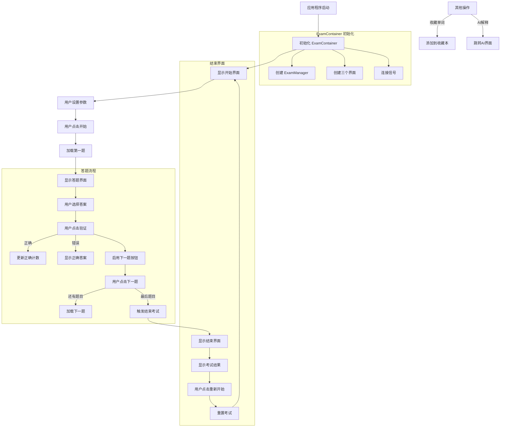
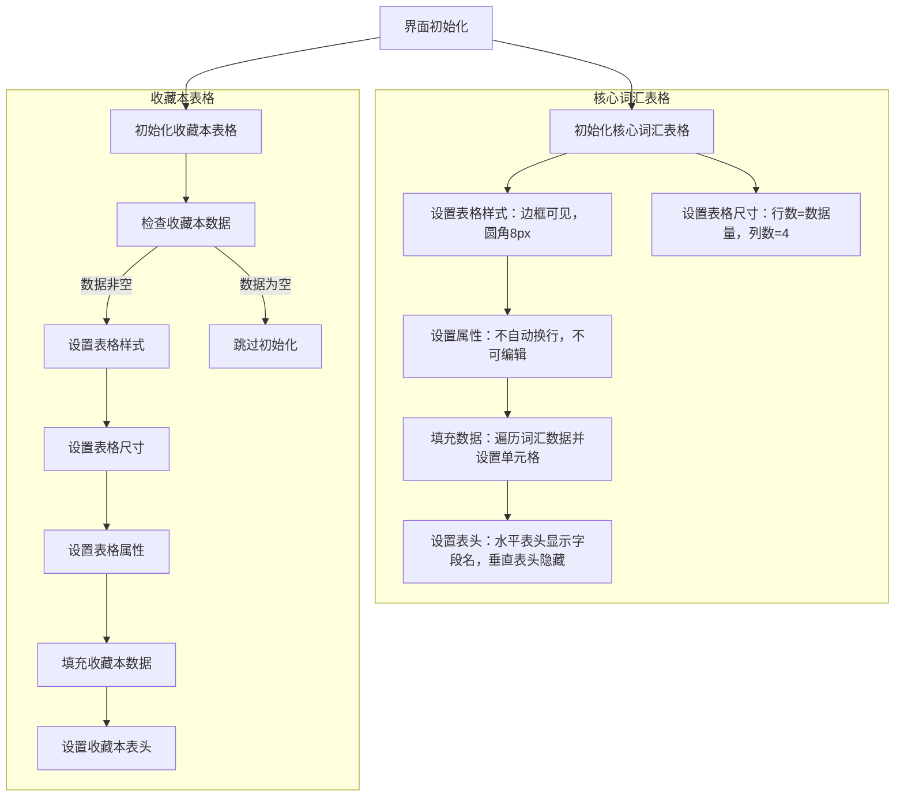
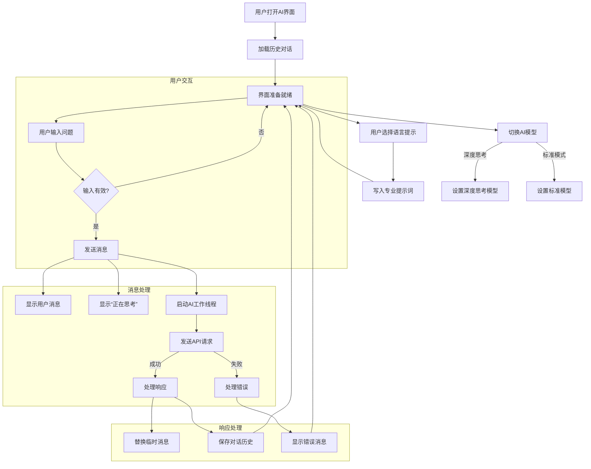

# 万词斩

author:让三颗心免于哀伤组：田照亿，桂诗清，张霖泽

[TOC]


## 1.程序功能介绍

本软件是一个多功能背单词软件，使用pyQT5，并导入了qfluentwidgets库，旨在模仿windows商店的风格，具体功能如下：

1. 在home界面可看到**每日背单词数量折线图**，**连续练习天数**，**当日日期**，**离3000个单词的目标还差多少**，**当前因连续练习而得到的倍数奖励**，会根据连续背的天数给多功能背单词软件乘**以相应的值**（独立乘区！）。
2. 在背诵时可选择自己的**主语言**，**学习语言**以及**难度**，会随机生成判断题与选择题
3. 复习时根据**艾宾浩斯遗忘曲线**自动从题库中抽取题目
4. 背诵单词页面**可收藏单词**和直接问deepseek，可直接跳转到deepseek页面并直接加上**提示词**和**对应单词**
5. deepseek界面可随时和deepseek探讨问题,并可以切换**深度思考模式**，通过按钮点击添加**提示词**等等
6. 背诵完成时会显示**每日背单词数量折线图**和**每题用时折线图**
7. 自动监测电脑的主题并初始化自己的，后续可通过设置**更改自己的主题**与**deekseek的api**
8. 在viewdata界面查看自己**收藏本中的单词和题库中的所有单词**

## 2.项目各模块与类设计细节

### 后端（见server/my_test.py)

#### 1. 整体架构

百词斩后端采用单一主类架构，核心功能集中在`VocabularyLearningSystem`类中，辅以内部记录类`RecordAC`。系统整体分为以下几个主要模块：

- 数据模型模块：负责管理单词数据和学习记录
- 单词管理模块：处理单词的选择、难度设置等
- 题目生成模块：生成不同类型的单词题目
- 学习记录模块：记录学习过程和结果
- 复习算法模块：实现基于记忆曲线的复习策略
- 统计分析模块：生成学习统计数据和图表

系统采用面向对象设计，通过类的方法封装各功能模块，使用 Pandas 进行数据处理，Matplotlib 进行数据可视化，并通过文件操作实现数据持久化。

#### 2. 核心类设计

##### 2.1 VocabularyLearningSystem 类

###### 类概述

`VocabularyLearningSystem`类是系统的核心类，实现了背单词软件的所有主要功能。它管理单词数据、生成学习题目、记录学习进度、实现复习算法，并提供统计分析功能。

###### 主要属性

- `df0-df5`：Pandas DataFrame，存储不同类型的单词数据和记录
- `mainlanguage`：当前学习的主要语言
- `studylanguage`：当前学习的目标语言
- `record`：`RecordAC`类实例，记录学习过程数据
- `current_level_df`：当前难度等级的单词数据

###### 主要方法

- `__init__()`：初始化系统，加载数据
- `choose_level(n)`：设置题目难度等级
- `set_languages(mainlanguage, studylanguage)`：设置学习语言
- `_choose_word()`：内部方法，根据记忆曲线选择单词
- `choose_word()`：从复习本中加权随机选择单词
- `_generate_options(correct_answer, language)`：生成选择题选项
- `generate_question()`：生成学习题目
- `generate_review_question()`：生成复习题目
- `handle_correct_answer(word)`：处理正确答案
- `handle_wrong_answer(word)`：处理错误答案
- `_save_progress()`：保存学习进度
- `add_to_book(word)`：添加单词到收藏本
- `review()`：复习功能
- `show_stats()`：显示学习统计
- `update_day_stats()`：更新每日统计
- `show_day_stats()`：显示每日统计图表
- `plot()`：生成答题用时图表
- `run()`：主运行循环

##### 2.2 RecordAC 类

###### 类概述

`RecordAC`类是`VocabularyLearningSystem`的内部类，用于记录学习过程中的答题数据。

###### 主要属性

- `ac`：答对题目数
- `wa`：答错题目数
- `time`：耗时记录列表
- `is_correct`：每题正误记录列表
- `data`：数据生成时间

###### 主要方法

- `__init__()`：初始化记录器
- `add_ac(t)`：记录正确答题
- `add_wa(t)`：记录错误答题

### 前端

#### 1.整体架构

前端界面采用 PyQt5 框架构建，使用 qfluentwidgets 库提供现代化 UI 组件。整体界面采用多模块设计，通过导航切换不同功能页面

#### 2.核心类设计

##### 2.1 登录模块（见client/main_window.py中的LoginDialog类）

- 用户输入用户名和密码。

- 如果用户名不存在，则注册新用户（将用户名和密码保存到users字典并写入文件）。

- 如果用户名存在且密码正确，则登录成功，进入主界面。

- 错误提示：如果用户名为空，提示输入用户名；如果用户名存在但密码错误，提示错误信息。

- ```mermaid
  graph LR
      A[开始] --> B[输入用户名和密码]
      B --> C{用户名是否为空?}
      C -- 是 --> D[提示'请输入用户名']
      D --> B
      C -- 否 --> E{用户是否存在?}
      E -- 不存在 --> F[注册新用户]
      F --> G[保存到用户字典]
      G --> H[写入文件]
      H --> I[进入主界面]
      E -- 存在 --> J{密码是否正确?}
      J -- 是 --> I[进入主界面]
      J -- 否 --> K[提示'密码错误']
      K --> B
  ```


##### 2.2 主窗口（见client/main_window.py中window类）

- 初始化时加载用户配置（通过UserConfig类）。

- 创建设置卡片（ColorSettingCard用于主题色，StrSettingCard用于API设置，HyperlinkCard用于跳转获取API的链接）。

- 创建并添加各个子界面：
   homeInterface: 主页，展示欢迎信息或主要功能入口。
   exam1Interface: 常规训练（routine training）。
   exam2Interface: 复习训练（review training）。
   aiInterface: DeepSeek AI交互界面。
   dataInterface: 数据查看界面，用于查看学习数据统计。
   settingInterface: 设置界面，包括主题色和API设置。

- 初始化导航栏：将各个子界面添加到导航栏，并设置图标和位置。

- 设置窗口固定大小（1024x768），并居中显示。

- ```mermaid
  graph LR
      A[开始初始化] --> B[加载用户配置]
      B --> C[创建设置卡片]
      
      C --> D1[ColorSettingCard]
      C --> D2[StrSettingCard]
      C --> D3[HyperlinkCard]
      
      B --> E[创建子界面]
      
      E --> F1[homeInterface]
      E --> F2[exam1Interface]
      E --> F3[exam2Interface]
      E --> F4[aiInterface]
      E --> F5[dataInterface]
      E --> F6[settingInterface]
      
      F6 --> G[添加设置卡片]
      G --> D1
      G --> D2
      G --> D3
      
      B --> H[初始化导航栏]
      H --> I1[添加主页]
      H --> I2[添加常规训练]
      H --> I3[添加复习训练]
      H --> I4[添加AI交互]
      H --> I5[添加数据查看]
      H --> I6[添加设置]
      
      I1 --> F1
      I2 --> F2
      I3 --> F3
      I4 --> F4
      I5 --> F5
      I6 --> F6
      
      H --> J[设置导航图标位置]
      J --> K[配置主窗口]
      
      K --> L[设置窗口大小 1024x768]
      L --> M[窗口居中显示]
      M --> N[显示主界面]
      N --> O[结束初始化]
      
      style A fill:#9f9,stroke:#333
      style O fill:#f9f,stroke:#333
      style B fill:#cdf,stroke:#333
      style C fill:#cdf,stroke:#333
      style D1 fill:#ffb,stroke:#333
      style D2 fill:#ffb,stroke:#333
      style D3 fill:#ffb,stroke:#333
      style F1 fill:#fbb,stroke:#333
      style F2 fill:#fbb,stroke:#333
      style F3 fill:#fbb,stroke:#333
      style F4 fill:#fbb,stroke:#333
      style F5 fill:#fbb,stroke:#333
      style F6 fill:#fbb,stroke:#333
  ```


##### 2.3 home界面（见client/Home_Widget.py)

- **功能**：作为软件的主页，提供多种训练模式的入口，显示当天日期和进度条，展示每日统计信息。
- 主要属性：

  - `card1` - `card4`：代表不同训练模式的卡片，点击可切换到相应界面。
  - `VLS`：`VocabularyLearningSystem` 类的实例，用于获取数据。
  - `today`、`todayn`、`weekday_num`：记录当前日期和星期几。

- 主要方法：

  - `__init__`：初始化界面，设置卡片和按钮的点击事件，更新日期和进度条信息。
  - `flush`：刷新界面信息。

- ```mermaid
  graph LR
      A[创建HomeWidget] --> B[初始化UI布局]
      B --> C[创建功能卡片]
      C --> D[常规训练卡片]
      C --> E[复习训练卡片]
      C --> F[DeepSeek卡片]
      
      B --> G[初始化学习系统]
      G --> H[加载学习数据]
      H --> I[显示统计图表]
      
      B --> J[设置日期信息]
      J --> K[显示当前日期星期]
      
      B --> L[设置进度条]
      L --> M[显示学习进度]
      
      D --> N[绑定切换界面事件]
      E --> N
      F --> N
      
      B --> O[设置刷新按钮]
      O --> P[刷新数据]
      P --> Q[重新加载学习数据]
      Q --> R[更新统计图表]
      Q --> S[更新连续天数]
      Q --> T[更新今日学习量]
      Q --> U[更新进度条]
      Q --> V[保存配置]
      
      style A fill:#9f9,stroke:#333
      style P fill:#f99,stroke:#333
      style N fill:#bbf,stroke:#333
      style I fill:#ffb,stroke:#333
      style M fill:#ffb,stroke:#333
  ```

##### 2.4 routine_training界面（见client/routine_training.py）

###### 系统主要功能

1. **考试流程控制**：管理考试状态（题号、正确计数等）
2. **多界面切换**：提供三个主要界面（开始、答题、结束）
3. **题目生成与验证**：从学习系统获取题目并验证答案
4. **学习进度跟踪**：记录单词学习情况和个人统计数据
5. **收藏功能**：可添加单词到生词本
6. **AI解释功能**：调用AI解释当前单词

###### 主要类及其功能

**1.ExamManager - 考试流程管理**

**主要属性**：

- `total_questions`：总题目数
- `current_index`：当前题号
- `correct_count`：正确答题数

**主要方法**：

- `reset()`：重置考试状态
- `move_next()`：进入下一题
- `progress`（属性）：计算当前进度百分比
- `accuracy`（属性）：计算当前正确率

**2.StartWidget - 开始界面**

**主要属性**：

- VLS：词汇学习系统实例
- level：难度级别
- mainlanguage：主语言
- studylanguage：学习语言

**主要方法**：

- `update_level()`：更新难度设置
- `update_mainlanguage()`：更新主语言
- `update_studylanguage()`：更新学习语言
- `_on_start_clicked()`：触发开始考试信号
- 

**3. QuizWidget - 答题界面**

**主要属性**：

- VLS：词汇学习系统实例
- manager：考试管理器实例
- currentoption：当前选项
- n：收藏跟踪计数

**主要方法**：

- `_init_ui()`：初始化界面
- `_load_question()`：加载题目
- `on_radio_toggled()`：处理选项选择
- `_on_check_clicked()`：验证答案并更新状态
- `_on_next_clicked()`：进入下一题或结束考试
- `addtobook()`：收藏当前单词
- `askdeepseek()`：调用AI解释功能
- 

**4. EndWidget - 结束界面**

**主要属性**：

- VLS：词汇学习系统实例
- manager：考试管理器实例

**主要方法**：

- `_init_ui()`：初始化界面
- `update_data()`：更新考试结果数据
- `_on_restart_clicked()`：触发重新开始信号

**5. ExamContainer - 主容器**

**主要属性**：

- VLS：词汇学习系统实例
- manager：考试管理器实例
- start_ui, quiz_ui, end_ui：三个界面实例
- stack：堆叠布局管理器

**主要方法**：

- `_init_ui()`：初始化界面布局
- `_connect_signals()`：连接所有信号
- `_switch_page()`：切换界面
- `_restart_exam()`：重启考试流程

###### 系统流程图




##### 2.5 review_traing界面(见client/Review_training.py)

与2.4routine_training大致相似，但在开始界面取消了难度选择功能


##### 2.6 data_view界面（见client/data_view_widget.py)

**功能**：数据展示界面的主类

**继承**：QWidget

**主要属性**：

- `parent`：父窗口引用
- `ui`：界面布局对象 (Ui_Form)
- `VLS`：词汇学习系统核心类实例
- `data`：核心词汇数据
- `data_book`：用户收藏本数据

**主要方法**

**`__init__(self, parent=None)`**

**功能**：界面初始化方法
​**流程**​：

1. 调用父类构造函数
2. 保存父窗口引用
3. 设置UI布局
4. 初始化词汇学习系统实例
5. 获取核心词汇数据和收藏本数据
6. 配置并填充核心词汇表格
7. 配置并填充收藏本表格（如果数据不为空）




##### 2.7 deepseek界面(见client/deepseek.py)

###### 主要功能

该模块实现了一个集成DeepSeek AI的词汇学习助手界面，主要功能包括：

1. 多语言词汇学习支持（英语、中文、日语）
2. 两种AI模型切换（深度思考和标准回答）
3. 对话历史保存与加载
4. 专业的词汇学习提示词模板
5. 美观的聊天界面设计

###### 主要类及其功能

**1. ChatTextEdit**

- **功能**：自定义聊天显示控件
- 主要属性：
  - `ai_format`：AI消息文本格式
  - `user_format`：用户消息文本格式
- 主要方法：
  - `append_message()`：添加消息到聊天窗口
  - `append_temp_message()`：添加临时"正在思考..."消息
  - `replace_temp_message()`：替换临时消息为最终响应

**2. AiWorker**

- **功能**：后台线程处理AI请求
- 主要属性：
  - `client`：DeepSeek API客户端
  - `messages`：对话消息历史
- 主要方法：
  - `run()`：执行AI请求，处理重试逻辑

**3. Ai_Widget**

- **功能**：AI助手主界面
- 主要属性：
  - `Username`：当前用户
  - `cfg`：系统配置
  - `client`：DeepSeek API客户端实例
  - `messages`：对话消息历史
  - `Prompt`：多语言词汇学习提示模板
- 主要方法：
  - `send_message()`：处理用户消息发送
  - `handle_response()`：处理AI响应
  - `handle_error()`：处理请求错误
  - `load_history()`：加载历史对话
  - `save_history()`：保存对话历史
  - `write_prompt_words()`：写入专业词汇提示词

###### 系统流程图




## 3.小组成员分工情况

由田照亿负责UI界面的设计，UI界面与后端代码的结合，设计文档的撰写，由桂诗清负责后端数据处理与统计画图，由张霖泽负责数据库的构建。

## 4.项目总结与反思

#### 田照亿

1. 调用了qfluentwidgets库，使界面比较优美
2. 用python来写真的是特别方便!!!人生苦短，我用python
3. 如何进行更好的团队协作，如何平衡风格一致性与分工合作之间的矛盾还需要进一步学习

#### 桂诗清

1. 为了追求工作效率和每个人任务的专职化，完全可以按照任务类型进行分工，而非按照传统的任务量划分。
2. 多重嵌套导致可读性降低，拆分核心功能为独立功能。
3. 每次答题都使用excel读取，导致效率低下。

#### 张霖泽

1. 对pandas的使用有了更深刻的了解（数据处理的工具又增加了）
2. 数据质量很重要，无论是对数据进行标签化，还有去除无效数据都是很重要的
3. 语言数量还有有些少，希望未来可以把更多主流语言加入
